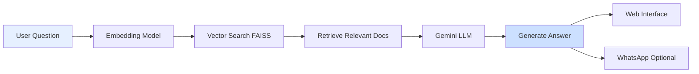

# 🤖 AI Customer Service RAG Chatbot

<div align="center">


**Intelligent customer service chatbot powered by RAG (Retrieval-Augmented Generation) with WhatsApp integration**

[Features](#-features) • [Installation](#-installation) • [Usage](#-usage) • [Architecture](#-architecture) • [API](#-whatsapp-integration)

</div>

---

## 📖 Overview

AI Customer Service is an advanced chatbot system that uses **RAG (Retrieval-Augmented Generation)** to provide accurate, context-aware answers based on your custom knowledge base. Built with LangChain, FAISS vector database, and powered by Google's Gemini AI, it can answer customer queries through a web interface and optionally send responses via WhatsApp using Twilio.

### 🎯 Key Highlights

- **RAG Architecture**: Retrieves relevant information before generating answers
- **Custom Knowledge Base**: Train on your own CSV data
- **Vector Search**: FAISS for fast, semantic similarity search
- **Arabic Support**: Handles Arabic questions and answers
- **WhatsApp Integration**: Optional Twilio integration for automated messaging
- **Web Interface**: Clean, responsive UI
- **Scalable**: FastAPI backend for production deployment

---

## ✨ Features

### 🧠 **RAG Pipeline**
- **Document Retrieval**: FAISS vector database for semantic search
- **Context-Aware Answers**: LangChain RetrievalQA chain
- **HuggingFace Embeddings**: sentence-transformers/all-MiniLM-L6-v2
- **Persistent Storage**: Save and load vectorstore

### 📚 **Knowledge Management**
- **CSV-Based Knowledge**: Easy data management
- **Custom Dataset**: Hair & skin care products (customizable)
- **Automatic Vectorization**: Build embeddings from CSV
- **Scalable Storage**: Add unlimited Q&A pairs

### 💬 **Communication Channels**
- **Web Interface**: FastAPI + Jinja2 templates
- **WhatsApp Integration**: Twilio API support
- **Real-time Responses**: Instant answer generation
- **Multi-language**: Arabic and English support

### 🎨 **User Interface**
- **Clean Design**: Blue gradient theme
- **Responsive Layout**: Mobile-friendly
- **Simple UX**: Single input field
- **Answer Display**: Formatted question/answer boxes

---

## 🏗️ Architecture

### RAG Pipeline



### System Architecture

```
┌─────────────────────────────────────────────┐
│         FastAPI Application Layer           │
├─────────────────────────────────────────────┤
│                                             │
│  ┌──────────────────────────────────────┐  │
│  │         RAG Pipeline                 │  │
│  ├──────────────────────────────────────┤  │
│  │                                      │  │
│  │  1. Question Embedding               │  │
│  │     ↓                                │  │
│  │  2. FAISS Vector Search              │  │
│  │     ↓                                │  │
│  │  3. Context Retrieval                │  │
│  │     ↓                                │  │
│  │  4. LLM Generation (Gemini)          │  │
│  │     ↓                                │  │
│  │  5. Answer Return                    │  │
│  │                                      │  │
│  └──────────────────────────────────────┘  │
│                                             │
│  ┌──────────────────────────────────────┐  │
│  │     FAISS Vector Database            │  │
│  │  (Local: vectorstore/)               │  │
│  └──────────────────────────────────────┘  │
│                                             │
│  ┌──────────────────────────────────────┐  │
│  │  Optional: Twilio WhatsApp API       │  │
│  └──────────────────────────────────────┘  │
│                                             │
└─────────────────────────────────────────────┘
              ▲
              │
    ┌─────────┴─────────┐
    │   knowledge.csv   │
    └───────────────────┘
```

### Tech Stack

| Component | Technology | Purpose |
|-----------|-----------|---------|
| **Backend** | FastAPI | Web server & API |
| **AI Framework** | LangChain | RAG orchestration |
| **LLM** | Google Gemini 2.0 Flash | Answer generation |
| **Vector DB** | FAISS | Semantic search |
| **Embeddings** | HuggingFace (MiniLM) | Text vectorization |
| **Messaging** | Twilio | WhatsApp integration |
| **Frontend** | HTML/CSS/Jinja2 | Web interface |
| **Data** | Pandas + CSV | Knowledge management |

---

## 🚀 Installation

### Prerequisites

- Python 3.8 or higher
- Google Gemini API Key ([Get it here](https://makersuite.google.com/app/apikey))
- Twilio Account (Optional, for WhatsApp) ([Sign up](https://www.twilio.com/))

### Step 1: Clone the Repository

```bash
git clone https://github.com/janaelpardisi/rag-customer-service.git
cd rag-customer-service
```

### Step 2: Create Virtual Environment

```bash
python -m venv venv

# On Windows
venv\Scripts\activate

# On macOS/Linux
source venv/bin/activate
```

### Step 3: Install Dependencies

```bash
pip install -r requirements.txt
```

### Step 4: Configure Environment Variables

Create a `.env` file in the project root:

```env
# Required
GEMINI_API_KEY=your_gemini_api_key_here

# Optional (for WhatsApp integration)
TWILIO_ACCOUNT_SID=your_twilio_sid
TWILIO_AUTH_TOKEN=your_twilio_token
TWILIO_PHONE_NUMBER=whatsapp:+14155238886
USER_PHONE_NUMBER=whatsapp:+201234567890
```

⚠️ **Important**: Never commit your `.env` file!

### Step 5: Build Knowledge Base

```bash
# Generate sample data
python build_data.py

# Build vector database
python build_vectorstore.py
```

### Step 6: Test RAG System

```bash
python rag_ai.py
```

---

## 💻 Usage

### Running the Web Application

```bash
uvicorn app:app --reload --host 0.0.0.0 --port 8000
```

**Access the interface:**
- Open browser: `http://localhost:8000`
- Enter your question
- Click "Ask"
- Get instant answer

### Using the CLI Version

```bash
python rag_ai.py
```

**Customize the question:**

```python
if __name__ == "__main__":
    q = "ما هي أفضل منتجات الشعر؟"
    print("❓ Question:", q)
    print("💬 Answer:", get_answer(q))
```

---

## 📁 Project Structure

```
rag-customer-service/
│
├── app.py                      # FastAPI web application
├── rag_ai.py                   # CLI version & RAG logic
├── build_data.py               # Generate sample knowledge CSV
├── build_vectorstore.py        # Create FAISS vector database
├── requirements.txt            # Python dependencies
├── .env                        # Environment variables (not in repo)
├── .gitignore                 # Git ignore file
├── README.md                  # This file
│
├── templates/
│   └── index.html             # Web interface
│
├── knowledge.csv              # Q&A dataset (generated)
│
└── vectorstore/               # FAISS database (generated)
    ├── index.faiss
    └── index.pkl
```

---

## 🔧 Configuration

### Customizing Your Knowledge Base

**Edit `build_data.py`:**

```python
data = [
    {"question": "Your question here?", 
     "answer": "Your answer here."},
    
    {"question": "Another question?", 
     "answer": "Another answer."},
    
    # Add more Q&A pairs...
]
```

**Rebuild the database:**

```bash
python build_data.py
python build_vectorstore.py
```

### Adjusting LLM Parameters

In `rag_ai.py` or `app.py`:

```python
llm = ChatGoogleGenerativeAI(
    model="gemini-2.0-flash",
    google_api_key=GEMINI_API_KEY,
    temperature=0.3,  # Lower = more focused
    max_tokens=500    # Control response length
)
```

### Changing Embedding Model

```python
embeddings = HuggingFaceEmbeddings(
    model_name="sentence-transformers/paraphrase-multilingual-MiniLM-L12-v2"
    # Better for Arabic support
)
```

### Retrieval Configuration

```python
qa_chain = RetrievalQA.from_chain_type(
    llm=llm,
    retriever=db.as_retriever(
        search_kwargs={"k": 3}  # Return top 3 relevant documents
    ),
)
```

---

## 📱 WhatsApp Integration

### Setup Twilio

1. **Create Twilio Account**: [https://www.twilio.com/](https://www.twilio.com/)
2. **Get WhatsApp Sandbox**: Navigate to Messaging → Try it out → Send a WhatsApp message
3. **Join Sandbox**: Send "join <your-code>" to the Twilio number
4. **Get Credentials**:
   - Account SID
   - Auth Token
   - WhatsApp number (e.g., +14155238886)

### Configure `.env`

```env
TWILIO_ACCOUNT_SID=ACxxxxxxxxxxxxxxxxxxxx
TWILIO_AUTH_TOKEN=your_auth_token
TWILIO_PHONE_NUMBER=whatsapp:+14155238886
USER_PHONE_NUMBER=whatsapp:+201234567890  # Your number
```

### Test WhatsApp

1. Run the app: `uvicorn app:app --reload`
2. Ask a question via web interface
3. Check your WhatsApp for the answer!

### Disable WhatsApp (Optional)

Simply don't add Twilio credentials to `.env`, and the system will skip WhatsApp messaging.

---

## 🔄 How It Works

### RAG Process Step-by-Step

1. **User Submits Question**
   - Via web interface or CLI
   - Question is sent to RAG pipeline

2. **Question Embedding**
   - Question converted to vector using HuggingFace model
   - 384-dimensional embedding created

3. **Vector Search**
   - FAISS searches for similar question embeddings
   - Returns top-k most relevant documents

4. **Context Retrieval**
   - Retrieved documents contain Q&A pairs
   - Context extracted from knowledge base

5. **LLM Generation**
   - Gemini receives question + context
   - Generates comprehensive answer

6. **Response Delivery**
   - Answer displayed on web page
   - Optionally sent via WhatsApp

### Example Flow

```
Question: "ما هي أفضل منتجات للشعر الجاف؟"

1. Embedding → [0.23, -0.45, 0.67, ...]

2. FAISS Search → Top 3 similar questions:
   - "ما هي أفضل منتجات لعلاج تساقط الشعر؟"
   - "هل يوجد منتجات طبيعية 100%؟"
   - "طريقة استخدام كريم الترطيب؟"

3. Context = Combined answers from knowledge base

4. Gemini generates answer using context

5. User receives: "سيروم الشعر بالكافيين وزيت الخروع..."
```

---

## 🐛 Troubleshooting

### Common Issues

**Issue**: `ModuleNotFoundError: No module named 'faiss'`

**Solution**:
```bash
pip install faiss-cpu  # For CPU
# OR
pip install faiss-gpu  # For GPU (requires CUDA)
```

---

**Issue**: `Vectorstore not found`

**Solution**:
```bash
# Build the vectorstore first
python build_data.py
python build_vectorstore.py
```

---

**Issue**: `GEMINI_API_KEY not found`

**Solution**:
- Create `.env` file in project root
- Add `GEMINI_API_KEY=your_key_here`
- Verify key at [Google AI Studio](https://makersuite.google.com/)

---

**Issue**: WhatsApp not working

**Solution**:
- Verify Twilio credentials in `.env`
- Ensure you joined the WhatsApp sandbox
- Check phone number format: `whatsapp:+1234567890`
- Verify Twilio account has credits

---

**Issue**: Slow response times

**Solution**:
```python
# Use smaller embedding model
embeddings = HuggingFaceEmbeddings(
    model_name="sentence-transformers/all-MiniLM-L6-v2"
)

# Reduce retrieved documents
retriever=db.as_retriever(search_kwargs={"k": 2})

# Lower temperature
llm = ChatGoogleGenerativeAI(temperature=0.1)
```

---

## 📊 Performance

### Benchmarks

- **Embedding Generation**: ~50ms per question
- **FAISS Search**: ~10ms for 1000 documents
- **LLM Response**: ~1-3 seconds (Gemini API)
- **Total Response Time**: ~2-4 seconds

### Scalability

- **Documents**: FAISS handles millions of vectors
- **Concurrent Users**: FastAPI supports async requests
- **Knowledge Base**: CSV scales to 10,000+ Q&A pairs

---

## 🎨 Customizing the UI

### Changing Colors

Edit CSS in `templates/index.html`:

```css
body {
    background-color: #e6f0ff;  /* Light blue */
}

button {
    background-color: #3399ff;  /* Primary blue */
}

.answer-box {
    background-color: #cce0ff;  /* Lighter blue */
}
```

### Adding Logo

```html
<h1>
    
    🤖 AI Customer Service
</h1>
```

---

## 🤝 Contributing

Contributions are welcome! Here's how:

1. **Fork** the repository
2. **Create** a feature branch (`git checkout -b feature/NewFeature`)
3. **Commit** your changes (`git commit -m 'Add NewFeature'`)
4. **Push** to the branch (`git push origin feature/NewFeature`)
5. **Open** a Pull Request

### Ideas for Contribution

- [ ] Add conversation history/memory
- [ ] Implement user authentication
- [ ] Add analytics dashboard
- [ ] Support multiple languages
- [ ] Add voice input/output
- [ ] Create mobile app
- [ ] Implement feedback system
- [ ] Add admin panel for knowledge management

---

## 📝 License

This project is licensed under the MIT License.

```
MIT License

Copyright (c) 2024 Jana Ashraf

Permission is hereby granted, free of charge, to any person obtaining a copy
of this software and associated documentation files (the "Software"), to deal
in the Software without restriction...
```

---

## 👨‍💻 Author

**Jana Ashraf**
- GitHub: [@janaelpardisi](https://github.com/janaelpardisi)
- LinkedIn: [Jana Ashraf](https://www.linkedin.com/in/jana-ashraf-elpardisi)

---

## 🙏 Acknowledgments

- [LangChain](https://langchain.com/) - For RAG framework
- [FAISS](https://github.com/facebookresearch/faiss) - For vector search
- [HuggingFace](https://huggingface.co/) - For embeddings
- [Google Gemini](https://deepmind.google/technologies/gemini/) - For LLM
- [Twilio](https://www.twilio.com/) - For WhatsApp API
- [FastAPI](https://fastapi.tiangolo.com/) - For web framework

---

## 📈 Roadmap

**Current Version**: v1.0

**Upcoming Features**:
- [ ] Multi-turn conversation support
- [ ] Advanced analytics & insights
- [ ] Support for PDF/Word documents
- [ ] Multi-language detection
- [ ] Voice interface
- [ ] Mobile app (React Native)
- [ ] PostgreSQL backend
- [ ] Redis caching layer
- [ ] Docker containerization
- [ ] Kubernetes deployment

---

## 💡 Use Cases

### E-Commerce
- Product recommendations
- Size/fit guidance
- Return policy questions
- Order status inquiries

### Healthcare
- Symptom checker
- Appointment scheduling
- Medication information
- General health Q&A

### Education
- Course information
- Enrollment process
- FAQs automation
- Student support

### Technical Support
- Troubleshooting guides
- Setup instructions
- Feature explanations
- Bug reporting

---

## 🔒 Security Best Practices

1. **API Keys**: Store in `.env`, never commit
2. **Validation**: Sanitize user inputs
3. **Rate Limiting**: Implement request throttling
4. **HTTPS**: Use SSL in production
5. **Authentication**: Add user login for production

---

<div align="center">

**Made with Jana Ashraf ❤️ and RAG Technology**

[⬆ Back to Top](#-ai-customer-service-rag-chatbot)

</div>
